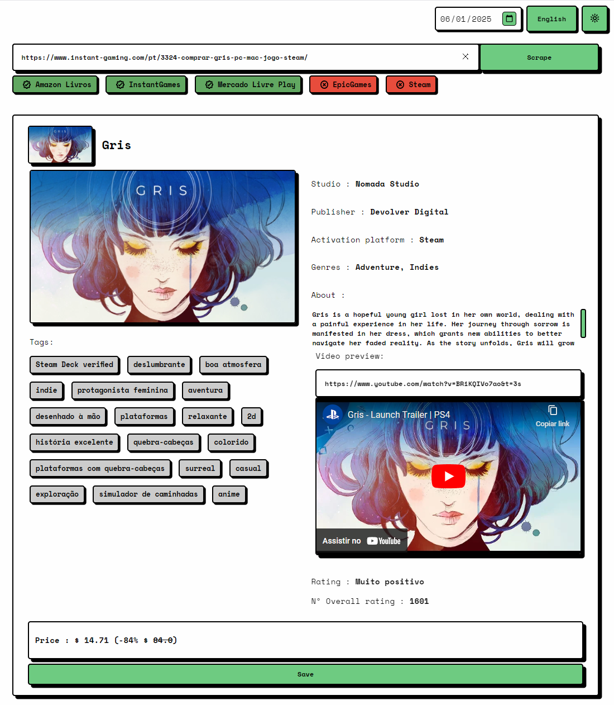
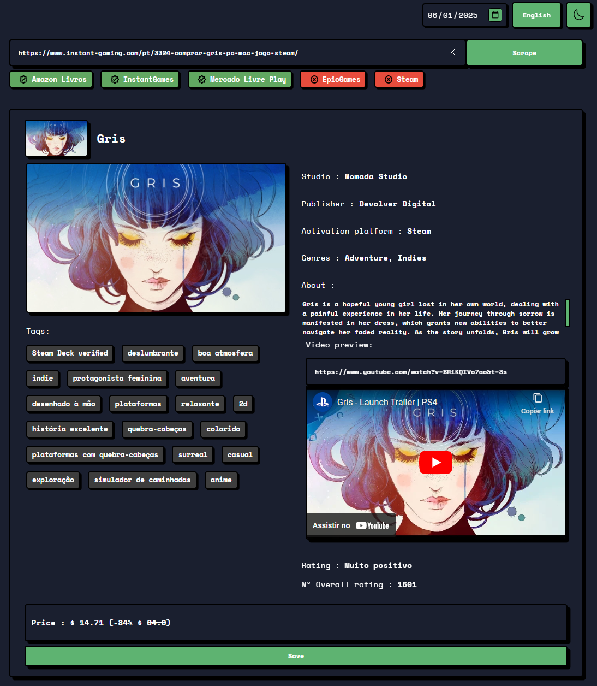

# Simple Neubrutalism CSS

Uma biblioteca CSS simples e minimalista para criar interfaces com estilo Neubrutalism (Neo-Brutalismo).

## Sobre

O Simple Neubrutalism CSS é uma biblioteca com componentes básicos para criar interfaces com o estilo Neo-Brutalista, caracterizado por:
- Bordas marcantes
- Sombras pronunciadas
- Cores vibrantes
- Visual "bruto" e direto

## Características

- 🎨 Modo claro e escuro
- 🎯 Foco em simplicidade
- 📦 Componentes básicos prontos para uso
- 🛠 Fácil de customizar através de variáveis CSS
- 🪶 Leve e sem dependências

## Exemplos

### Modo Claro


### Modo Escuro


## Uso

1. Adicione o arquivo CSS ao seu projeto:
```html
<link rel="stylesheet" href="neubrutalism.css">
```

2. Use os atributos e classes em seus elementos:
```html
<!-- Botão com estilo neubrutalism -->
<button>Clique aqui</button>

<!-- Input com estilo neubrutalism -->
<input type="text" placeholder="Digite algo...">

<!-- Elemento com borda neubrutalism -->
<div nbtl-border>Conteúdo</div>
```

## Customização

Você pode personalizar as cores e medidas através das variáveis CSS:

```css
:root {
  --primary-color: #FFD93D;
  --border-color: #4C3D3D;
  --background-color: #FFF8E3;
  --font-color: #4C3D3D;
  --secondary-color: #FFB200;
  --border-size-default: 3px;
  --box-shadow-size-default: 6px;
}
```
